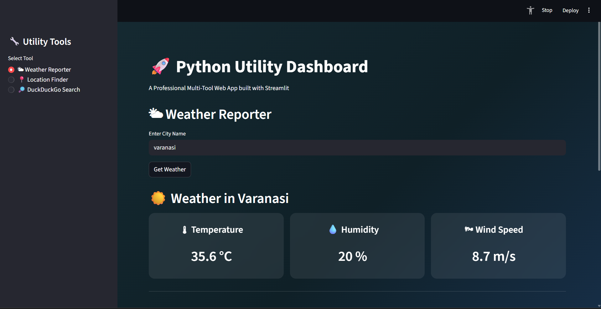

# Frontend with Script
</img>

## All 3 Scripts are available in 1
- weather
- location
- DuckDuckGo search results

## Stack
- Frontend - Streamlit Python
- Backend logic - Scripts (<a href="https://github.com/coderujwal3/Python-Scripting-Project">Got from Friend</a>)

### collaborations
## Contributors
<!-- ALL-CONTRIBUTORS-BADGE:START - Do not remove or modify this section -->

<!-- ALL-CONTRIBUTORS-BADGE:END -->

Thanks goes to these wonderful people ([emoji key](https://allcontributors.org/docs/en/emoji-key)):

<!-- ALL-CONTRIBUTORS-LIST:START - Do not remove or modify this section -->
<!-- prettier-ignore-start -->
<!-- markdownlint-disable -->
<table>
  <tbody>
    <tr>
      <td align="center" valign="top" width="14.28%"><a href="https://github.com/coderujwal3"> <b>Ujwal Singh</b></a></td>
    </tr>
  </tbody>
</table>
<!-- ALL-CONTRIBUTORS-LIST:END -->